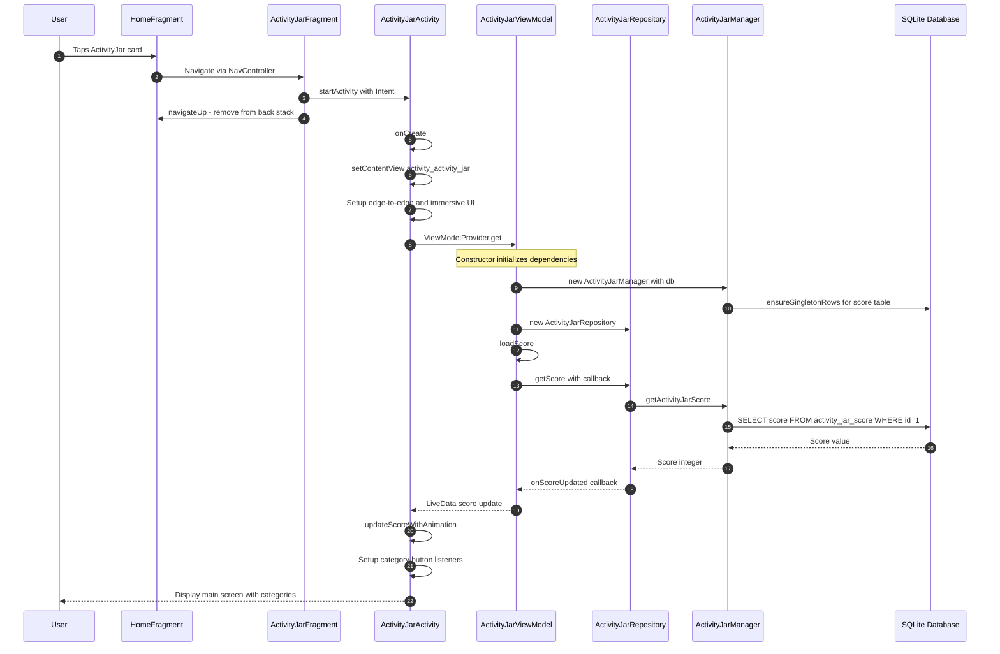
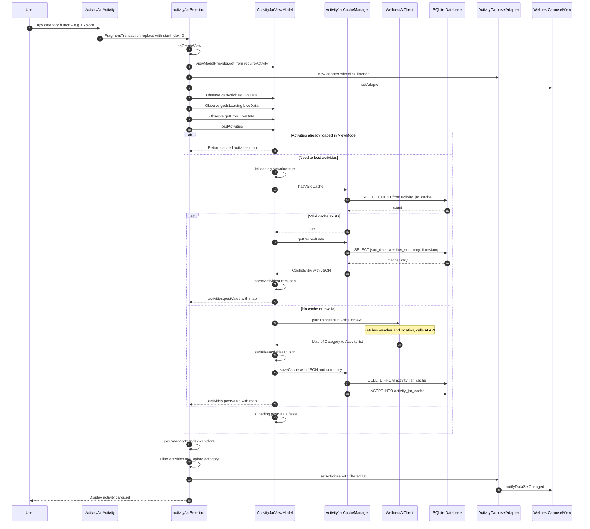
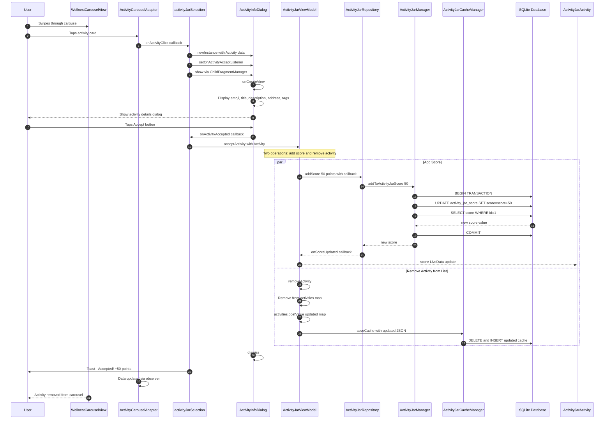
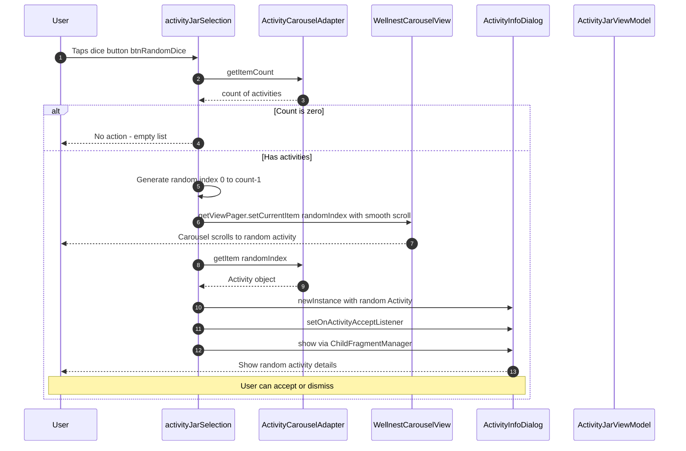
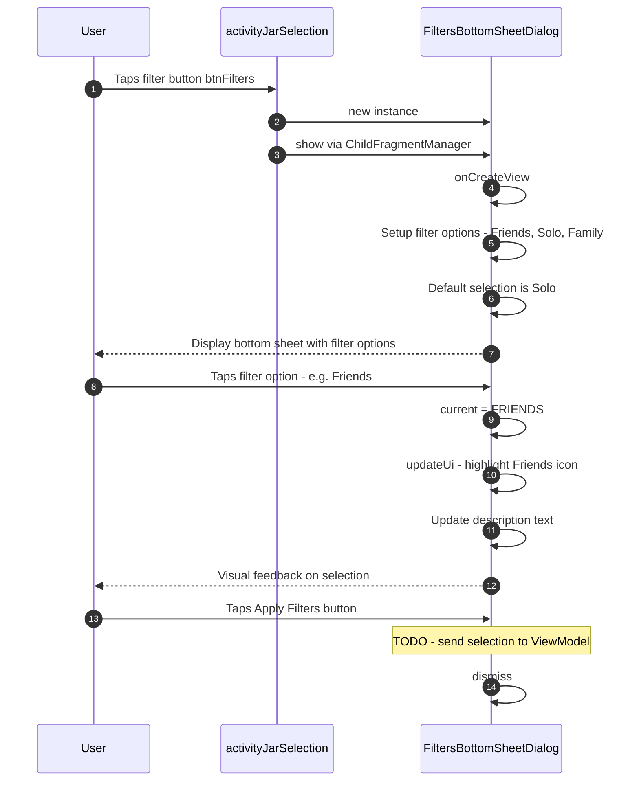
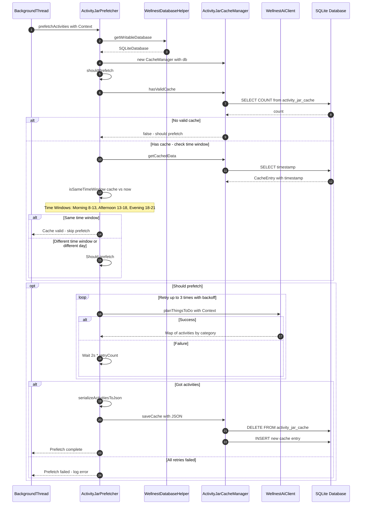
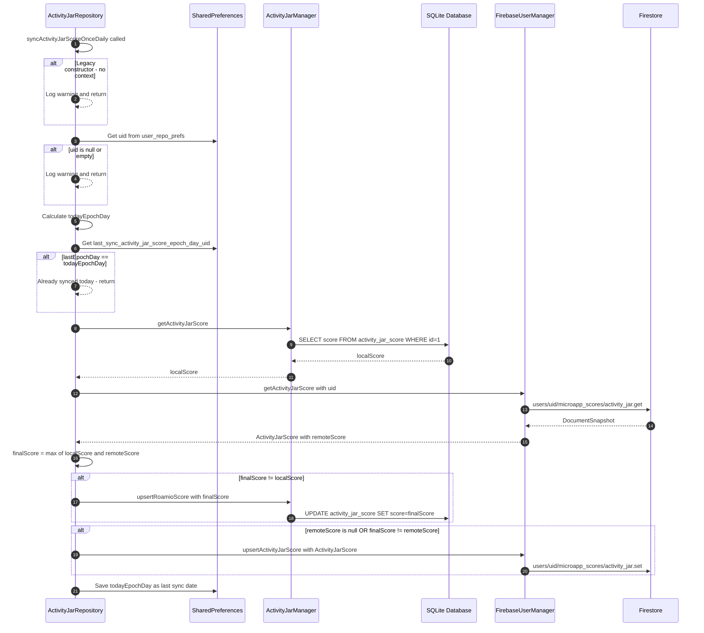

# ActivityJar Micro App - Sequence Diagrams

## Overview

ActivityJar is an AI-powered activity suggestion micro app within the Wellnest Android application. It generates personalized activity recommendations across five categories (Explore, Nightlife, Play, Cozy, Culture) using AI and local context like weather and location. Users browse activities in a carousel, view details, and "accept" activities to earn points that contribute to their overall score.

### Architecture Components

| Layer | Component | Description |
|-------|-----------|-------------|
| **UI** | `ActivityJarFragment` | Launcher fragment that starts ActivityJarActivity |
| **UI** | `ActivityJarActivity` | Main screen with category buttons and score display |
| **UI** | `activityJarSelection` | Fragment showing activities carousel for selected category |
| **UI** | `ActivityCarouselAdapter` | RecyclerView adapter for activity cards |
| **UI** | `ActivityInfoDialog` | Dialog showing activity details with Accept button |
| **UI** | `FiltersBottomSheetDialog` | Bottom sheet for Friends/Solo/Family filters |
| **ViewModel** | `ActivityJarViewModel` | Manages activities map, loading state, errors, and score |
| **Repository** | `ActivityJarRepository` | Orchestrates local SQLite and remote Firebase operations |
| **Local** | `ActivityJarManager` | SQLite score operations |
| **Local** | `ActivityJarCacheManager` | SQLite cache for AI-generated activities |
| **External** | `WellnestAiClient` | AI service for generating activity suggestions |
| **Utility** | `ActivityJarPrefetcher` | Background prefetching with time-window logic |

---

## 1. App Startup - Opening ActivityJar

This diagram shows the flow when a user opens the ActivityJar micro app from the home screen.

---

## 2. Category Selection and Activity Browsing

This diagram shows the flow when a user selects a category and browses activities.

---

## 3. Viewing Activity Details and Accepting

This diagram shows the complete flow when a user views an activity's details and accepts it.

---

## 4. Random Activity Selection - Dice Feature

This diagram shows the flow when a user taps the dice button to get a random activity.

---

## 5. Filters Bottom Sheet

This diagram shows the filter selection flow.

---

## 6. Background Prefetching

This diagram shows the background prefetching mechanism that runs to ensure activities are cached ahead of time.

---

## 7. Score Synchronization - Local to Firebase

This diagram shows the once-daily score synchronization between local SQLite and Firebase Firestore.

---

## Key Interactions Notes

### Data Flow Pattern
The ActivityJar micro app follows a clean MVVM architecture:
1. **UI Layer** → Fragments and Dialogs handle user interactions and display
2. **ViewModel Layer** → Exposes LiveData for activities, loading state, errors, and score
3. **Repository Layer** → Orchestrates between local SQLite and remote Firebase
4. **Data Layer** → Separate managers for score (ActivityJarManager) and cache (ActivityJarCacheManager)

### AI-Powered Activity Generation
- Activities are generated by `WellnestAiClient.planThingsToDo()` using AI
- AI considers local context like weather and location
- Results are cached in SQLite to avoid repeated API calls
- Activities are organized by 5 categories: Explore, Nightlife, Play, Cozy, Culture

### Caching Strategy
- Activities are cached as JSON in `activity_jar_cache` table
- Cache includes timestamp and weather summary
- Time-window based invalidation: Morning (8-13), Afternoon (13-18), Evening (18-21)
- Prefetcher runs in background to ensure fresh activities

### Score System
- Users earn +50 points per accepted activity
- Score stored locally in singleton row (id=1) in `activity_jar_score` table
- Score synced to Firebase once daily using epoch day tracking
- "Never decrease" strategy: max(local, remote) wins during sync

### Category System
Activities are organized into 5 categories mapped by index:
- **0**: Explore - Outdoor adventures and discovery
- **1**: Nightlife - Evening entertainment
- **2**: Play - Games and recreational activities
- **3**: Cozy - Relaxing indoor activities
- **4**: Culture - Arts, museums, cultural experiences

### Filter System (Partial Implementation)
- FiltersBottomSheetDialog provides Friends/Solo/Family filter options
- Currently UI-only; filter application to ViewModel/Repository is TODO

### Threading Model
- UI operations: Main thread
- Activity loading: Background ExecutorService in ViewModel
- Cache operations: Same background thread
- AI API calls: Background thread (WellnestAiClient handles internally)
- Score operations: Background ExecutorService in Repository
- Prefetching: Explicit background thread required

### Key UI Components
- **WellnestCarouselView**: Custom ViewPager2 wrapper for smooth carousel experience
- **ActivityCarouselAdapter**: Binds activity data to carousel cards
- **ActivityInfoDialog**: Full-featured dialog with emoji, title, description, address, tags