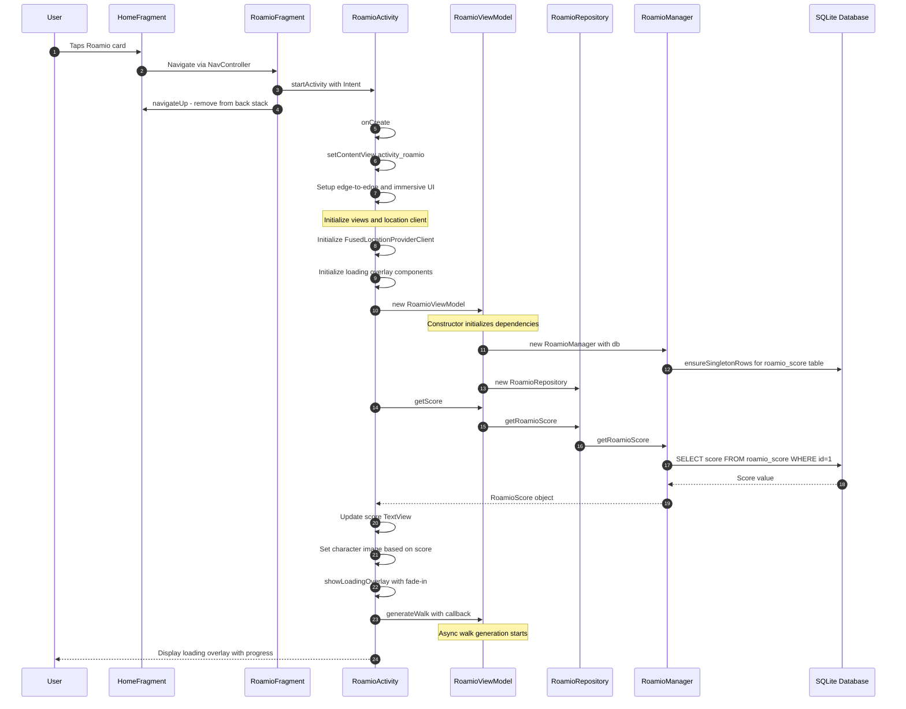
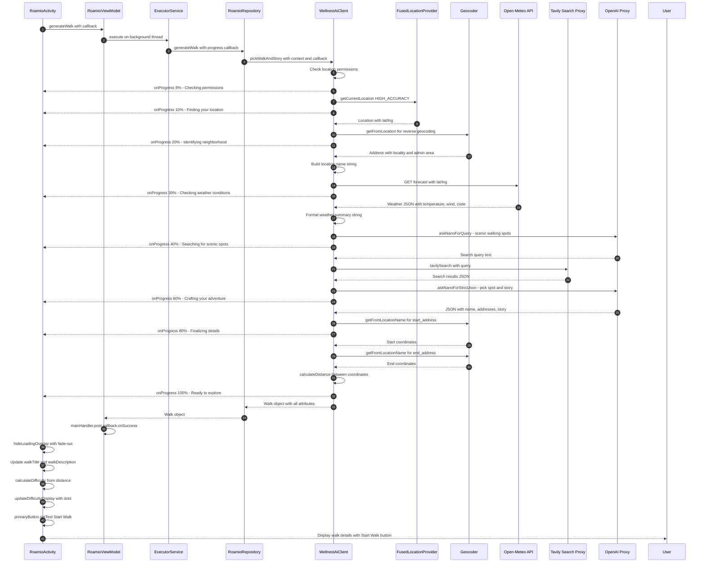
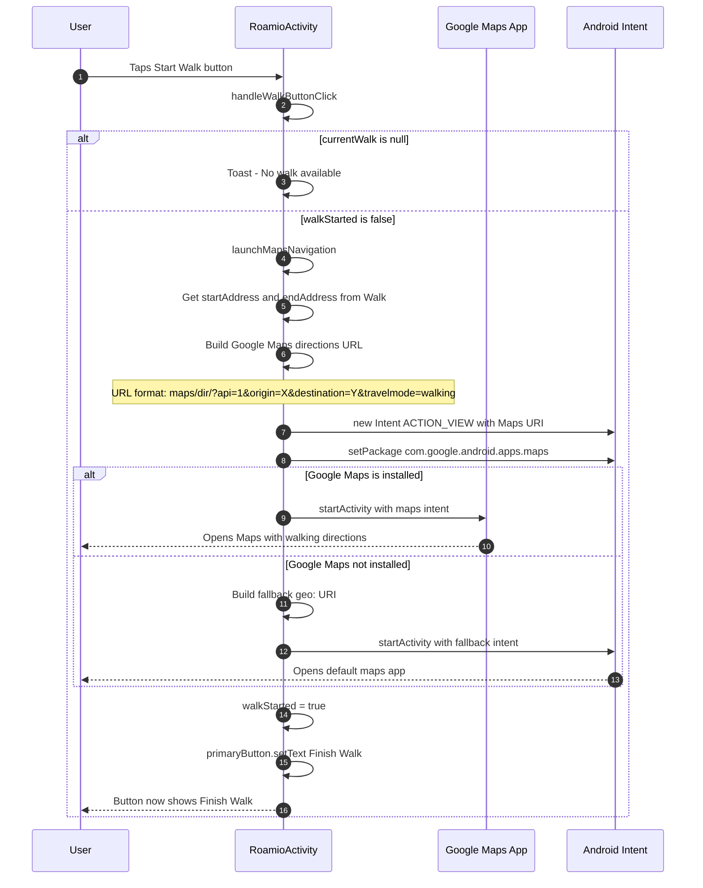
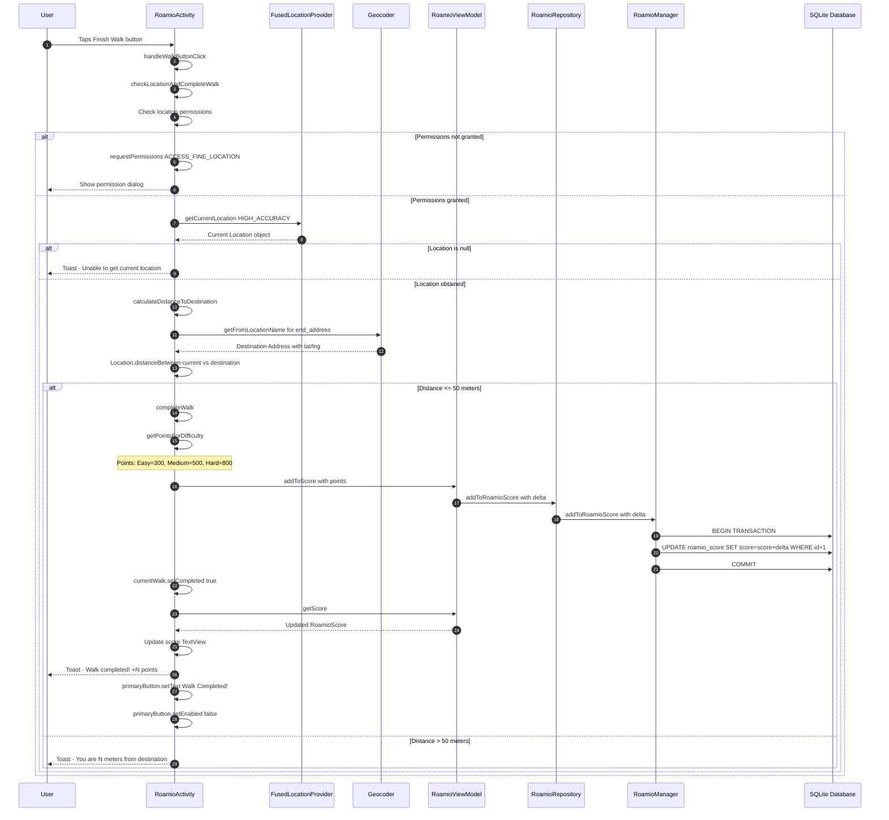
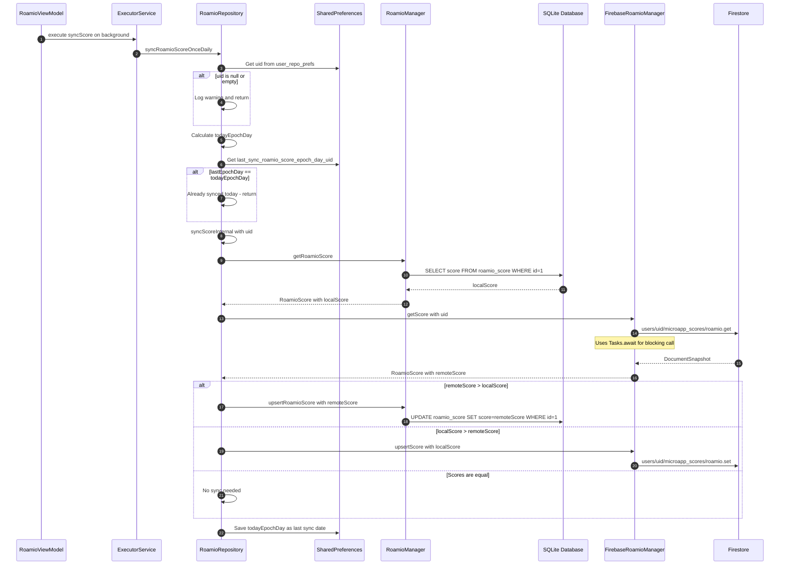
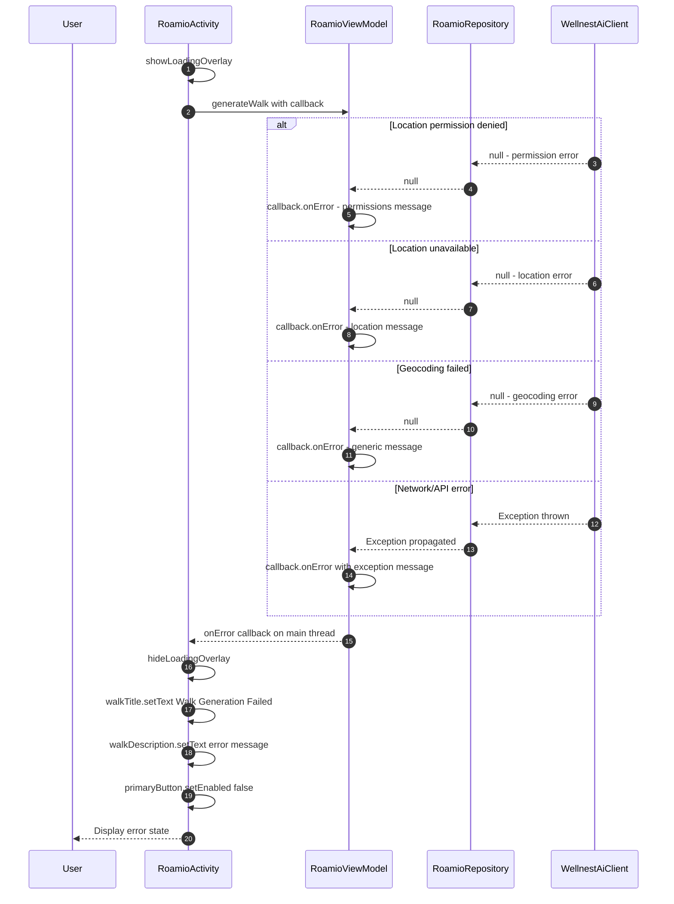

# Roamio Micro App - Sequence Diagrams

## Overview

Roamio is an AI-powered walking adventure micro app within the Wellnest Android application. It generates personalized walking recommendations based on the user's location, weather conditions, and local points of interest. Users start walks with Google Maps navigation, then verify completion by being within 50 meters of the destination. Points are awarded based on walk difficulty, contributing to character evolution.

### Architecture Components

| Layer | Component | Description |
|-------|-----------|-------------|
| **UI** | `RoamioFragment` | Launcher fragment that starts RoamioActivity |
| **UI** | `RoamioActivity` | Main screen with walk display, maps integration, location verification |
| **ViewModel** | `RoamioViewModel` | Manages score and async walk generation with callbacks |
| **Repository** | `RoamioRepository` | Orchestrates local/remote data and AI walk generation |
| **Local** | `RoamioManager` | SQLite database operations for score |
| **Remote** | `FirebaseRoamioManager` | Firestore score synchronization |
| **External** | `WellnestAiClient` | AI-powered walk generation with location and weather |
| **External** | `Google Maps` | Navigation to walk destination |
| **External** | `FusedLocationProvider` | GPS location services |

---

## 1. App Startup - Opening Roamio

This diagram shows the flow when a user opens the Roamio micro app from the home screen.

---

## 2. Walk Generation via AI

This diagram shows the detailed AI-powered walk generation flow.

---

## 3. Starting a Walk - Maps Navigation

This diagram shows the flow when a user taps the Start Walk button.

---

## 4. Completing a Walk - Location Verification

This diagram shows the flow when a user taps Finish Walk and location is verified.

---

## 5. Score Synchronization - Local to Firebase

This diagram shows the once-daily score synchronization between local SQLite and Firebase Firestore.

---

## 6. Walk Generation Error Handling

This diagram shows error handling during walk generation.

---

## Key Interactions Notes

### Data Flow Pattern
The Roamio micro app follows a clean MVVM architecture:
1. **UI Layer** → Activity handles user interactions, maps launch, and location verification
2. **ViewModel Layer** → Exposes score and async walk generation with callbacks to UI
3. **Repository Layer** → Orchestrates local SQLite, remote Firebase, and AI generation
4. **Data Layer** → Separate managers for SQLite and Firestore operations
5. **AI Layer** → WellnestAiClient handles all external API calls

### AI-Powered Walk Generation
- Uses FusedLocationProviderClient for GPS location
- Reverse geocodes coordinates to human-readable location name
- Fetches weather from Open-Meteo API
- Generates search query via GPT-5-nano
- Searches for scenic spots via Tavily API
- Synthesizes results and generates story via GPT-5-nano
- Geocodes start/end addresses to calculate distance

### Point System Based on Difficulty
Walk difficulty is determined by distance:
- **Easy** (<1000m): 300 points
- **Medium** (1000-2500m): 500 points
- **Hard** (>2500m): 800 points

### Character Evolution
The puffin character evolves based on total score:
- **Baby Puffin**: 0-499 points
- **Teen Puffin**: 500-999 points
- **Adult Puffin**: 1000-1499 points
- **Senior Puffin**: 1500+ points

### Location Verification
- Uses 50-meter completion radius
- Geocodes destination address to coordinates
- Calculates distance using Location.distanceBetween
- Requires location permissions for verification

### Score Synchronization
- Once-daily sync using epoch day tracking
- Higher score wins strategy between local and remote
- Uses SharedPreferences to track last sync date per user

### Threading Model
- UI operations: Main thread
- Walk generation: Background ExecutorService with main thread callbacks
- Score operations: Called synchronously from ViewModel
- Firebase operations: Use Tasks.await for blocking calls - must be on background thread
- Progress callbacks: Posted to main thread via Handler

### External Dependencies
- **Google Play Services**: FusedLocationProviderClient for GPS
- **Google Maps**: Navigation via Intent
- **Android Geocoder**: Address-to-coordinates and reverse geocoding
- **Open-Meteo API**: Weather data (no authentication required)
- **Tavily API**: Web search for local points of interest (via Vercel proxy)
- **OpenAI API**: GPT-5-nano for query generation and story synthesis (via Vercel proxy)