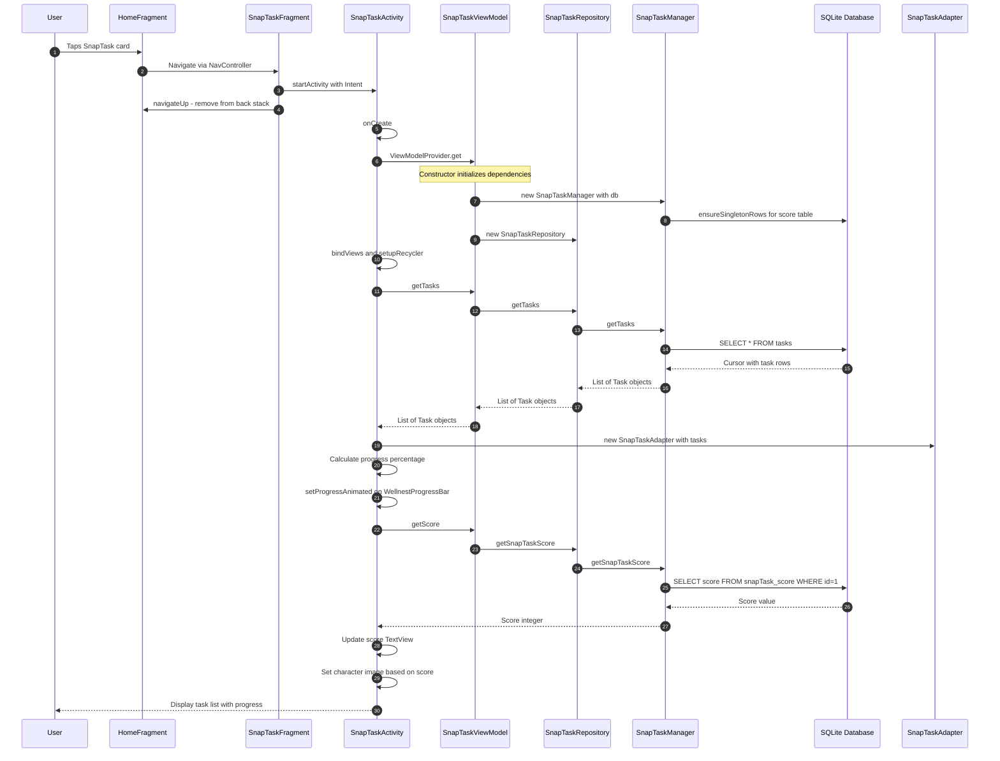
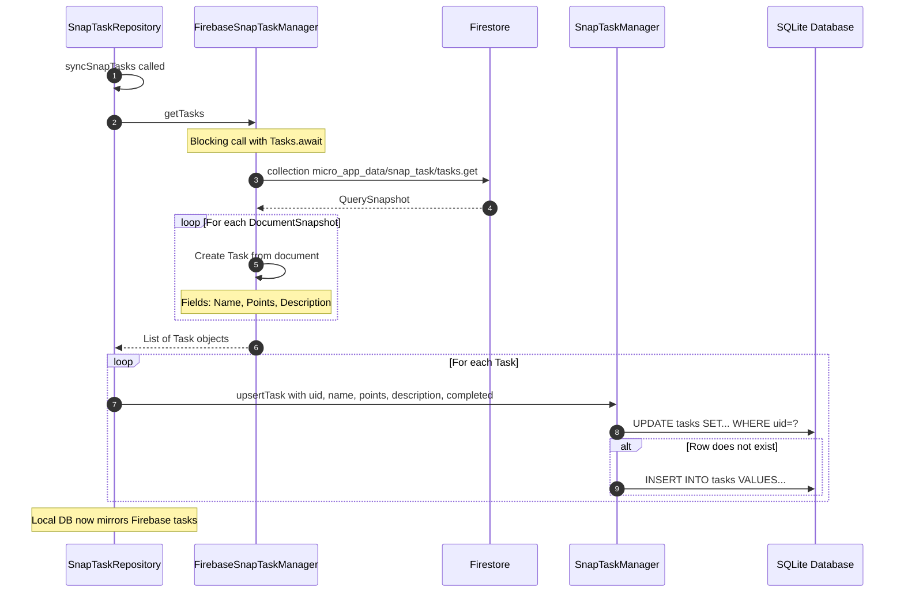
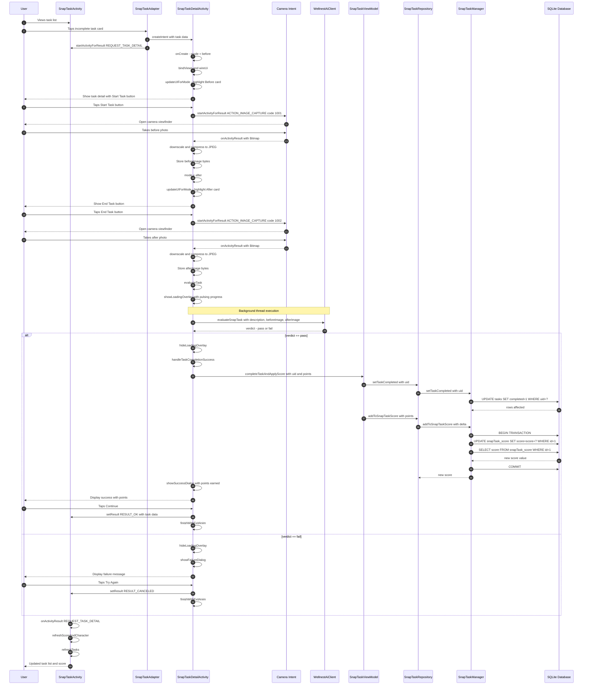
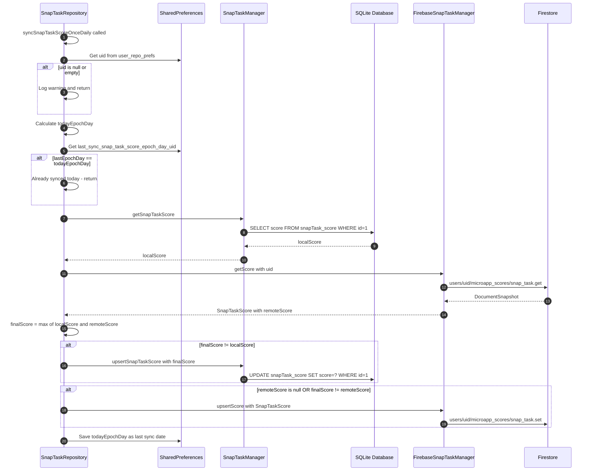
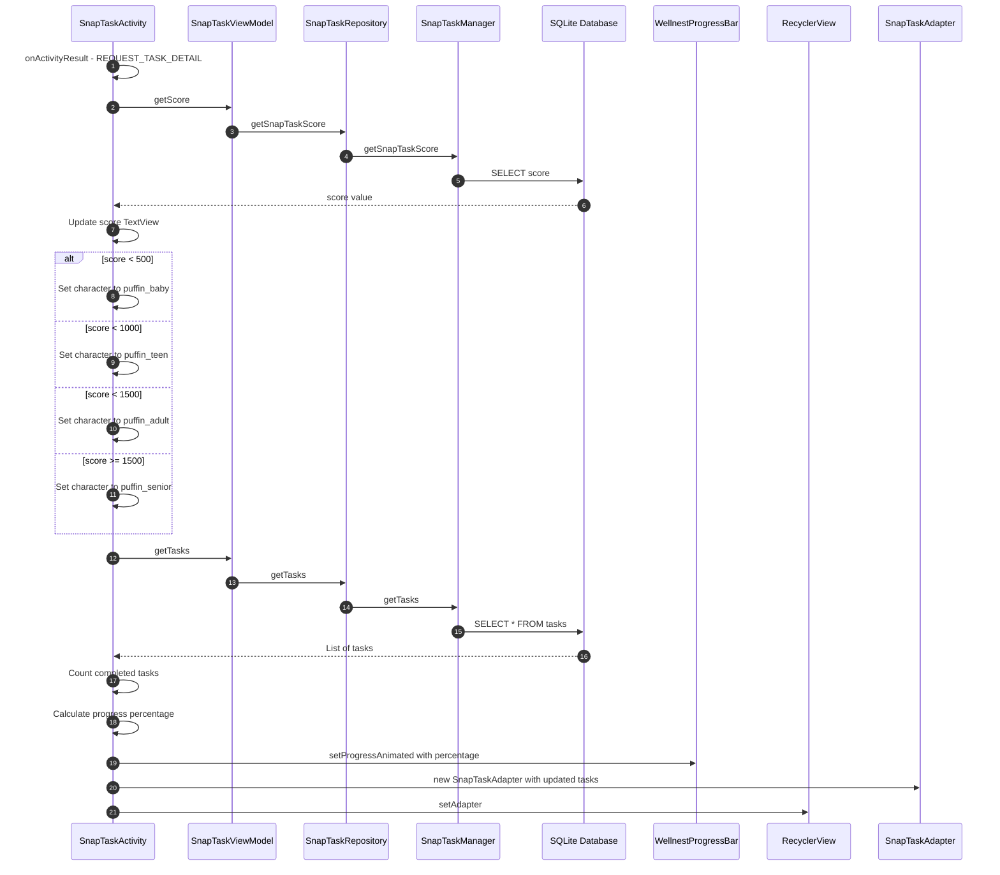

# SnapTask Micro App - Sequence Diagrams

## Overview

SnapTask is a gamified task completion micro app within the Wellnest Android application. Users complete tasks by taking "before" and "after" photos, which are then evaluated by an AI to verify task completion. Upon successful completion, users earn points that contribute to their overall score, which evolves their character through different life stages.

### Architecture Components

| Layer | Component | Description |
|-------|-----------|-------------|
| **UI** | `SnapTaskActivity` | Main task list screen with RecyclerView |
| **UI** | `SnapTaskFragment` | Launcher fragment that starts SnapTaskActivity |
| **UI** | `SnapTaskAdapter` | RecyclerView adapter for task cards |
| **UI** | `SnapTaskDetailActivity` | Task detail with photo capture and AI evaluation |
| **ViewModel** | `SnapTaskViewModel` | Manages UI state and repository access |
| **Repository** | `SnapTaskRepository` | Orchestrates local and remote data sources |
| **Local** | `SnapTaskManager` | SQLite database operations |
| **Remote** | `FirebaseSnapTaskManager` | Firestore operations |
| **External** | `WellnestAiClient` | AI task evaluation service |

---

## 1. App Startup - Loading Tasks

This diagram shows the flow when a user opens the SnapTask micro app from the home screen.

---

## 2. Task Sync from Firebase

This diagram shows how tasks are synchronized from Firestore to the local SQLite database. This typically happens during app initialization or when refreshing data.

---

## 3. Completing a Task - Full Flow

This is the most complex flow, showing how a user completes a task with before/after photos and AI evaluation.

---

## 4. Score Synchronization - Local to Firebase

This diagram shows the once-daily score synchronization between local SQLite and Firebase Firestore.

---

## 5. Task List Refresh After Completion

This diagram shows the simplified refresh flow when returning from task detail.

---

## Key Interactions Notes

### Data Flow Pattern
The SnapTask micro app follows a clean MVVM architecture:
1. **UI Layer** → Activities and Adapters handle user interactions and display
2. **ViewModel Layer** → Exposes data to UI and delegates to Repository
3. **Repository Layer** → Orchestrates between local and remote data sources
4. **Data Layer** → Separate managers for SQLite and Firestore operations

### Local-First Design
- All task data is read from local SQLite database for fast UI rendering
- Firebase sync happens in background, pulling task definitions from Firestore
- Score is stored locally and synchronized with Firebase once daily using epoch day tracking

### AI Evaluation
- Photos are downscaled to max 480px dimension and compressed to 70% JPEG quality
- Evaluation happens on a background thread to avoid blocking UI
- WellnestAiClient receives task description and both images to determine pass/fail

### Character Evolution
The puffin character evolves based on total score:
- **Baby Puffin**: 0-499 points
- **Teen Puffin**: 500-999 points  
- **Adult Puffin**: 1000-1499 points
- **Senior Puffin**: 1500+ points

### Threading Model
- UI operations: Main thread
- Database operations: Called synchronously from ViewModel - consider moving to background
- Firebase operations: Use `Tasks.await` for blocking calls - must be on background thread
- AI evaluation: Explicit background thread with `runOnUiThread` callback